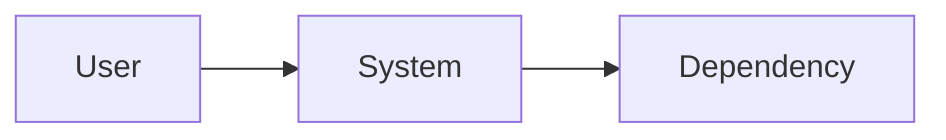

# Full Software Specification Template

Use this only for work that warrants a full specification. Delete sections that add no decision or verification value. For a mandatory risk category that was considered and found irrelevant, write `None — [reason]`.

## Contents

- Metadata and decision summary
- Context, goals, and requirements
- System behavior, interfaces, data, and design
- Security, operations, verification, rollout, and rollback
- Open questions, implementation slices, and change history

````markdown
---
title: [Decision-oriented title]
status: draft | proposed | accepted | implementing | implemented | rejected | superseded | archived
owner: [DRI]
reviewers:
  product: []
  engineering: []
  security_privacy: []
  reliability_operations: []
created: YYYY-MM-DD
last_updated: YYYY-MM-DD
decision_deadline: YYYY-MM-DD
related: [issues, ADRs, incidents, designs]
---

# [Title]

## 1. Decision summary
- **Problem:**
- **Proposed direction:**
- **Expected outcome:**
- **Decision required:**
- **Current status:**

## 2. Context and evidence
### Current state
### Evidence table
| Claim | Evidence | Confidence | Implication |
|---|---|---:|---|
### Stakeholders and audience
### Glossary / prerequisite knowledge

## 3. Scope
### Goals
### Non-goals
### Success measures
Use `[BLOCKING: owner-approved target]` or `[DELEGATED: measurement method]` rather than inventing missing values.
| Outcome | Metric | Baseline | Target | Measurement window | Owner |
|---|---|---:|---:|---|---|
### Constraints

## 4. Scenarios
### Primary user journeys
### Alternate, error, cancellation, and recovery journeys
### Administrative and operational journeys
### Lifecycle, migration, and compatibility journeys
### Abuse and threat scenarios

## 5. Requirements

Use stable IDs and one obligation per statement.

| ID | Requirement | Rationale/source | Priority | Verification | Status |
|---|---|---|---|---|---|

### Functional requirements (`FR-*`)
### Quality requirements and SLOs (`QR-*`)
### Security and privacy (`SEC-*`)
### Data integrity and lifecycle (`DATA-*`)
### Interfaces and compatibility (`INT-*`)
### Operations and support (`OPS-*`)

## 6. Proposed design
### System context and boundaries

### Components and responsibilities
| Component | Responsibility | Data owned | Interfaces | Failure behaviour |
|---|---|---|---|---|
### Runtime / sequence flows
### State model and invariants
### Data model, ownership, retention, and migration
### APIs, events, idempotency, and error semantics
### Concurrency, ordering, retries, timeouts, and backpressure
### Failure handling and degraded modes
### Security and privacy design / threat model
### Observability and operations

## 7. Alternatives and decisions
| Option | Advantages | Disadvantages | Risks | Outcome |
|---|---|---|---|---|
### Status quo / do nothing
### Linked ADRs

## 8. Delivery and change safety
### Dependencies and sequencing
### Migration and compatibility
### Enable/disable and blast-radius control
### Staged rollout
### Rollback and data recovery
### Upgrade/downgrade/version skew
### Capacity and cost
### Documentation, support, and runbooks

## 9. Verification
| Requirement | Evidence | Level | Command/location | Pass condition |
|---|---|---|---|---|
### Existing regression suite
### New test plan
### Security, performance, migration, and resilience evidence
### Production validation
### Acceptance owner

## 10. Risks and unresolved work
### Risks
| Risk | Likelihood | Impact | Mitigation | Trigger | Owner |
|---|---:|---:|---|---|---|
### Assumptions
| Assumption | Confidence | Validation method | Deadline | Owner |
|---|---:|---|---|---|
### Open questions
| Question | Blocking / delegated / deferred | Resolution method | Owner | Due |
|---|---|---|---|---|
### Deferred work

## 11. Agent implementation plan

For each task:

### TASK-[NN] — [Objective]
- **Requirements covered:**
- **Expected files/components:**
- **Preconditions/dependencies:**
- **Implementation steps:**
- **Tests to add/update:**
- **Verification command:**
- **Expected result:**
- **Rollback/cleanup:**
- **Parallel-safety:**

## 12. Traceability
| Need / goal | Requirement | Decision / ADR | Task | Code / PR | Evidence |
|---|---|---|---|---|---|

## 13. Change log and references
````
